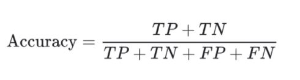

# Context
Banknotes are one of the most important assets of a country. Some miscreants introduce fake notes which bear a resemblance to original note to create discrepancies of the money in the financial market. It is difficult for humans to tell true and fake banknotes apart especially because they have a lot of similar features.

..........................................................

**Motivation**: Despite a decrease in the use of currency due to the recent growth in the use of electronic transactions, cash transactions remain very important in the global market. Banknotes are used to carry out financial activities. To continue with smooth cash transactions, entry of forged banknotes in circulation should be preserved. There has been a drastic increase in the rate of fake notes in the market. Fake money is an imitation of the genuine notes and is created illegally for various motives. These fake notes are created in all denominations which brings the financial market of the country to a low level. The various advancements in the field of scanners and copy machines have led the miscreants to create copies of banknotes. It is difficult for human-eye to recognize a fake note because they are created with great accuracy to look alike a genuine note. Security aspects of banknotes have to be considered and security features are to be introduced to mitigate fake currency. Hence, there is a dire need in banks and ATM machines to implement a system that classifies a note as genuine or fake.

**[Source of Information**: A research paper on Analysis of Banknote Authentication System using Machine Learning Techniques by Sumeet Shahani, Aisa Jagiasi and Priya RL at International Journal of Computer Applications (0975 – 8887) Volume 179 – No.20, February 2018]

# Objective
Being a Data Science Enthusiast, you committed yourself to use the power of Data Science and come up with an efficient model that accurately predicts if a note is genuine or not.

# Evaluation Criteria
Submissions are evaluated using **Accuracy Score**. How do we do it? 

Once you generate and submit the target variable predictions on the test dataset, your submissions will be compared with the true values of the target variable. 

The True or Actual values of the target variable are hidden on the DPhi platform so that we can evaluate your model's performance on unseen data. Finally, an accuracy score for your model will be generated and displayed.

## About the Data
Data were extracted from images that were taken for the evaluation of an authentication procedure for banknotes. Data were extracted from images that were taken from genuine and forged banknote-like specimens. For digitization, an industrial camera usually used for print inspection was used. The final images have 400x 400 pixels. Due to the object lens and distance to the investigated object grey-scale pictures with a resolution of about 660 dpi were gained. Wavelet Transform tool was used to extract features from images.

To load the training data in your jupyter notebook, use the below command:

`import pandas as pd`

`bank_note_data = pd.read_csv`("https://raw.githubusercontent.com/dphi-official/Datasets/master/bank_note_data/training_set_label.csv" )

**Data Description**

**VWTI**: Variance of Wavelet Transformed Image
**SWTI**: Skewness of Wavelet Transformed Image
**CWTI**: Curtosis of Wavelet Transformed Image
**EI**: Entropy of Image
**Class**: Class (1: genuine, 0: forged)

**Test Dataset** Load the test data (name it as test_data). You can load the data using the below command.

`test_data = pd.read_csv`('https://raw.githubusercontent.com/dphi-official/Datasets/master/bank_note_data/testing_set_label.csv')

Here the target column is deliberately not there as you need to predict it.

Acknowledgement
The dataset is downloaded from the UCI Machine Learning Repository.
