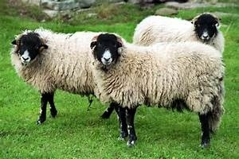

# Assignment 2- Recognize an Animal in an Image

## Context
Image recognition is a vital component in robotics such as driverless vehicles or domestic robots. Image recognition is also important in image search engines such as Google or Bing image search whereby you use rich image content to query for similar stuff. Like in Google photos where the system uses image recognition to categorize your images into things like cats, dogs, people and so on so that you can quickly search your albums for things like, “give me photos of my cat”, that's awesome. 

.....................................................................................................................................

Ever noticed how Facebook instantly recognises your friend’s face and asks you if you want to tag him in that photo? That’s image recognition. That’s just a basic example.

## Objective
You are working on a robotics project where you are required to train your robot so that it can differentiate between two animals. Your task here is to build a deep learning model that helps you recognize the animal in images.

## Evaluation Criteria
Submissions are evaluated using Accuracy Score.

 
# Accuracy = TP + TN / (TP + TN + FP + FN)


How do we do it? 

Once you generate and submit the target variable predictions on the test dataset, your submissions will be compared with the true values of the target variable. 

The True or Actual values of the target variable are hidden on the DPhi platform so that we can evaluate your model's performance on unseen data. Finally, an accuracy score for your model will be generated and displayed.


### About the Data

The training dataset consists of 1200 medium quality animal images belonging to 2 categories: mucca (cow) and pecora (sheep). All the images have been collected from "google images" and have been checked by humans. There is some erroneous data to simulate real conditions (eg. images taken by users of your app).

### Dataset Link: (https://github.com/dphi-official/Datasets/tree/master/animal_data)

There are 4 files:

**train_beg.zip** - contains the images of cows and sheeps that are to be used for training and validation of the model. Each image has a unique name like - image_1, image_2, etc.
 
**Training_set_animals.csv** - contains the image’s filename and their corresponding target value (i.e. the actual animal name). You can load this file using the below command:

`Training_set_animals = pd.read_csv`("https://raw.githubusercontent.com/dphi-official/Datasets/master/animal_data/Training_set_animals.csv")
 
**test_beg.zip** - contains the images of cows and sheeps whose predictions you are to submit on the DPhi platform. Instructions to load this data is given in assignment 2 guidelines on the Deep Learning Bootcamp dashboard.
 
**Testing_set_animals.csv** - this is the order of the predictions for each image that is to be submitted on the platform. Make sure the predictions you download are with their image’s filename in the same order as given in this file. You can load this file using the given command (please notice that the test set does not have any header):

`Testing_set_animals = pd.read_csv`("https://raw.githubusercontent.com/dphi-official/Datasets/master/animal_data/Testing_set_animals.csv", header=None)

OR

Please follow the below instructions to load the dataset in Notebook.

Download Data From GitHub
First we need to get the data. We have given the GitHub link under the 'Data' section of the problem page which has all the required train images (to build the model) and test datat images for which one need to predict the labels (animal specie) and submit the predictions on the DPhi platform.

Download GitHub Repository
The first step is to download the repository 'Datasets' to the colab files. We can achieve this by executing the below code.

`!git clone 'https://github.com/dphi-official/Datasets/`

## To unzip train_beg.zip
`!unzip /content/Datasets/animal_data/train_beg.zip` 

## To unzip test_beg.zip
`!unzip /content/Datasets/animal_data/test_beg.zip`

```{python} {import pandas as pd
import numpy as np
train_labels = pd.read_csv("/content/Datasets/animal_data/Training_set_animals.csv")
train_labels.head()}
